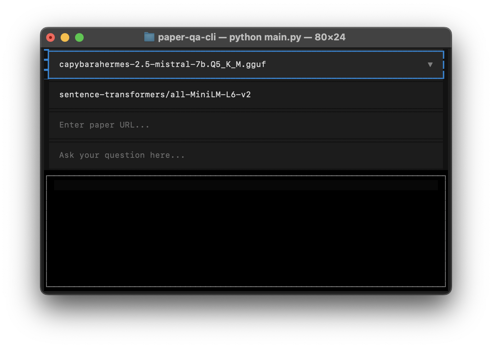
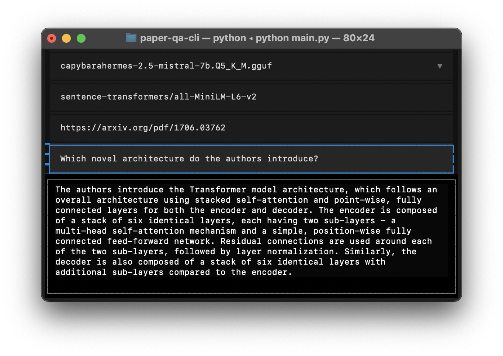

# Paper Question-Answering CLI

**Paper QA** is a command-line interface (CLI) application for question-answering over scientific papers. It
uses [LangChain](https://github.com/langchain-ai/langchain), [llama.cpp](https://github.com/ggml-org/llama.cpp), [FAISS](https://github.com/facebookresearch/faiss),
with the UI built using [Textual](https://github.com/Textualize/textual).

## Installation

### Python Environment

This project requires **Python 3.10**. To set up a virtual environment:

```shell
python3.10 -m venv .venv
source .venv/bin/activate
```

Install dependencies (without hardware acceleration):

```shell
pip install -r requirements.txt
```

To use a different backend, follow the installation instructions provided
by [llama-cpp-python](https://github.com/abetlen/llama-cpp-python?tab=readme-ov-file#supported-backends).

For example, to enable Metal (MPS) support for M-series Macs:

```shell
CMAKE_ARGS="-DLLAMA_METAL=on" FORCE_CMAKE=1 pip install -r requirements.txt
```

### Model

Paper QA uses models in **GGUF format**, which must be downloaded and placed in the `models` directory.

To get started, download
the [CapybaraHermes-2.5-Mistral-7B](https://huggingface.co/argilla/CapybaraHermes-2.5-Mistral-7B) model using the
provided script:

```shell
sh download_model.sh
```

## How to use

To start the application, run:

```shell
python3 main.py
```

You will be greeted with an interface like this:



All models found in the `models` directory will be available in the model selector. You can also switch the embeddings
model to any `sentence-transformers` model.

Paste the URL of a web-based paper or the path to a local PDF, enter your question, and press Enter:


